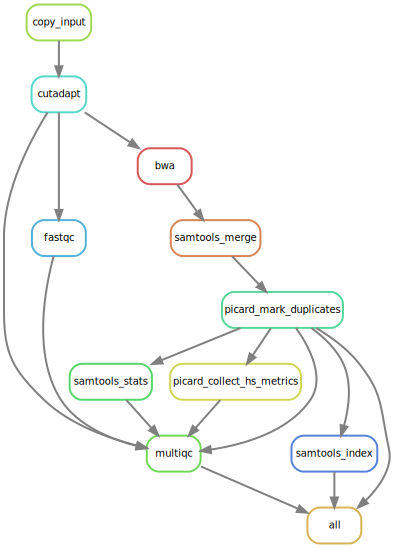
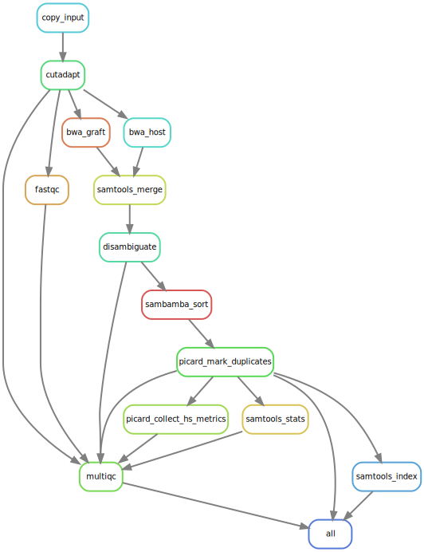

Overview
========

The workflow can be run in two modes: the 'standard' workflow (for normal
sequencing) data and a 'PDX' workflow, which handles host/graft read separation
for patient-derived xenograft samples.

Standard workflow
-----------------

The standard workflow essentially performs the following steps:

* The input reads are trimmed to remove adapters and/or poor quality base calls
  using cutadapt.
* The trimmed reads are aligned to the reference genome using bwa mem.
* The alignments are sorted and indexed using samtools.
* Bam files from multiple lanes are merged using picard MergeSamFiles.
* Picard MarkDuplicates is used to remove optical/PCR duplicates.
* The final alignments are indexed using samtools index.

QC statistics are generated using fastqc, samtools stats and picard
CollectHSMetrics (to assess bait coverage). The stats are summarized into a
single report using multiqc.

This results in the following dependency graph:

PDX workflow
------------

The PDX workflow is a slightly modified version of the standard workflow, which
aligns the reads to two reference genome (the host and graft reference genomes)
and uses disambiguate_ to remove sequences originating from the host organism.
For typical PDX samples, this means removing the mouse (host) reads, leaving
the human (graft) reads for further analysis.

The PDX workflow adds the following additional steps:

* The reads are aligned to two references in ``bwa_host`` and ``bwa_graft``
  instead of using a single reference.
* The resulting alignments are sorted by queryname using samtools and
  'disambiguated' using disamgibuate.
* The disambiguated alignments are sorted by queryname using sambamba.

This results in the following dependency graph:

.. _disambiguate: https://github.com/AstraZeneca-NGS/disambiguate
